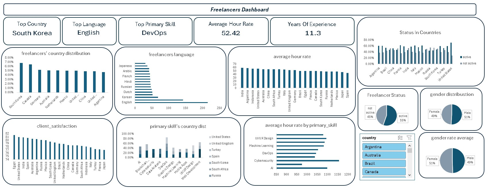

# 🌍 Freelancer Data Analysis & Dashboard

##  📌 Project Overview
This project analyzes freelancer data from various countries, focusing on their skills, languages, experience, hourly rates, and activity status. The goal is to understand the distribution of freelancers globally and visualize key insights through a dashboard.

## Dataset
The dataset contains the following columns:
- `freelancer_ID`
- `name`
- `gender`
- `age`
- `country`
- `language`
- `primary_skill`
- `years_of_experience`
- `hourly_rate (USD)`
- `rating`
- `is_active`
- `client_satisfaction`

##  🔍  Analysis Questions Answered
- Average years of experience for each field
- Top languages used by freelancers
- Average hourly rate for each primary skill over countries
- Average hourly rate per country
- Percentage of active freelancers per country
- Overall active vs inactive freelancer percentage
- Average client satisfaction rating per country
- Most common freelance field in each country
- Top 10 countries with the highest number of freelancers
- Average hourly rate by gender (male vs. female)
- Gender distribution in the freelance workforce

##  🛠️ Tools Used
- Data cleaning: Pandas (Python).
- Data analysis: SQL queries.
- Visualization: Excel dashboard.

## 🧩 Project Structure

Here's a breakdown of the files included in this repository:

| File/Folder        | Description |
|--------------------|-------------|
| `cleaning_code.py` | Python script using Pandas to clean and preprocess the freelancer dataset (handling nulls, formatting, etc.) |
| `queries.sql`      | A collection of SQL queries used to extract insights and perform data analysis |
| `dashboard.png`    | A static image of the final dashboard visualizing key metrics |
| `README.md`        | Project documentation |
  

## 📊 Dashboard Preview

> This dashboard summarizes the key findings from the dataset, including the most common skills, top countries, average hourly rates, and client satisfaction.
